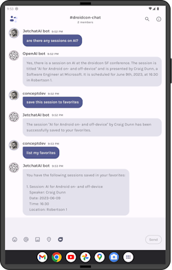

# LLM chat demo for Android (using OpenAI)

This repo was originally created for a talk at droidcon SF 2023. The [session page](droidcon-sf-23.md) has details of what was presented.

The chat demo is based on the [Jetpack Compose _Jetchat_ sample from Google](https://github.com/android/compose-samples/raw/main/Jetchat/).

There's also a PaLM-based chat channel hiding in there too 😉

## History/documentation

The Jetchat-AI demo has been built up over a few months to be a 'first principles' demonstration of incorporating an LLM chat into an Android app using Kotlin. Over time it has grown to include image generation API, function calling, embeddings and RAG pattern, sliding window for token limit, and conversation memory.

| Blogpost | Notes |
|------|-------|
| [Jetchat with OpenAI on Android](https://devblogs.microsoft.com/surface-duo/android-openai-chatgpt-5/) | Build an OpenAI-powered chat with the _Jetchat_ Jetpack Compose sample using the `chat` and `image` APIs |
| [JetchatAI improvements: error handling and animations](https://devblogs.microsoft.com/surface-duo/android-openai-chatgpt-6/) | Add error handling and useability tweaks to JetchatAI |
| [JetchatAI gets smarter with embeddings](https://devblogs.microsoft.com/surface-duo/android-openai-chatgpt-7/) | Generate embeddings for an entire conference so we can chat about the schedule |
| [OpenAI chat functions on Android](https://devblogs.microsoft.com/surface-duo/android-openai-chatgpt-9-functions/) | Implement the canonical `getWeather` chat function in Kotlin |
| [Coming OpenAI function calls with embeddings](https://devblogs.microsoft.com/surface-duo/android-openai-chatgpt-10/) | Add date/time grounding and implement functions to return conference info by time |
| [Chat memory with OpenAI functions](https://devblogs.microsoft.com/surface-duo/android-openai-chatgpt-11/) | Add a Sqlite database to store 'favorite sessions' and implement chat functions to store, delete, and retrieve the favorites list |
| [Embedding vector caching](https://devblogs.microsoft.com/surface-duo/android-openai-chatgpt-12/) | Store embedding vectors in Sqlite on device |
| [Dynamic Sqlite queries with OpenAI chat functions](https://devblogs.microsoft.com/surface-duo/android-openai-chatgpt-13/) | Implement the canonical `askDatabase` chat function using a simple conference sessions schema |
| [Prompt engineering tips](https://devblogs.microsoft.com/surface-duo/android-openai-chatgpt-14/) | Some prompt engineering lessons learned on the JetchatAI project |
| [OpenAI and token limits](https://devblogs.microsoft.com/surface-duo/android-openai-chatgpt-15/) | Brief discussion on tokens which leads into the next few posts on managing limited context |
| [Infinite chat using a sliding window](https://devblogs.microsoft.com/surface-duo/android-openai-chatgpt-16/) | Avoid token limit errors with a sliding window on the chat history |
| [De-duplicating context in the sliding window](https://devblogs.microsoft.com/surface-duo/android-openai-chatgpt-17/) | Make the sliding window a little more efficient by removing duplicate grounding info |
| ["Infinite" chat with history summarization](https://devblogs.microsoft.com/surface-duo/android-openai-chatgpt-18/) | Squeeze more historical context in by summarizing the oldest messages to fit more in the window |
| [Infinite chat with history embeddings](https://devblogs.microsoft.com/surface-duo/android-openai-chatgpt-19/) | Create embeddings of the messages to act as conversation memory |
